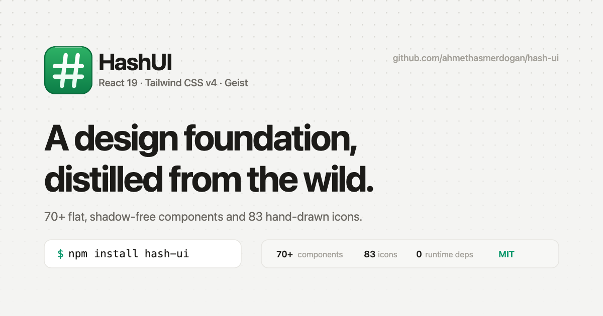

<div align="center">


# UICean

**A design foundation, distilled from the wild.**

A flat, shadow-free **React + Tailwind CSS v4** design system — 96 components,
25 page blocks, 83 hand-drawn icons and five accent themes, rebuilt from curated
interface references.
Install it from npm, or copy any component into your repo with the shadcn CLI.

[](https://www.npmjs.com/package/uicean)
[](LICENSE)
[](https://react.dev)
[](https://tailwindcss.com)

### **[uicean.vercel.app →](https://uicean.vercel.app)**

[Changelog](CHANGELOG.md) · [Contributing](CONTRIBUTING.md)



</div>

---

## Install

```bash
npm install uicean
```

```css
/* src/index.css — order matters */
@import "tailwindcss";
@import "uicean/css";
```

```tsx
import { ThemeProvider, ToastProvider, Button, StatusPill } from "uicean";

export default function App() {
  return (
    <ThemeProvider>
      <ToastProvider>
        <Button variant="green">Get started for Free</Button>
        <StatusPill tone="green">Accepted</StatusPill>
      </ToastProvider>
    </ThemeProvider>
  );
}
```

That is the whole setup. No config file, no plugin, no runtime dependency beyond
React — [full guide →](https://uicean.vercel.app/docs/installation)

### …or copy the source in instead

Every component is also a [shadcn registry](https://ui.shadcn.com/docs/registry)
item, so you can take the code rather than the dependency:

```bash
npx shadcn@latest add https://uicean.vercel.app/r/button.json   # one component
npx shadcn@latest add https://uicean.vercel.app/r/uicean.json   # the whole library
```

The registry is plain JSON with permissive CORS, so anything that speaks HTTP can
read it:

```bash
curl https://uicean.vercel.app/r/registry.json | jq '.items[].name'
curl https://uicean.vercel.app/r/button.json  | jq -r '.files[0].content'
```

[Registry docs →](https://uicean.vercel.app/docs/registry)

### Blocks

Whole strips of a page — heroes, feature grids, footers, app shells, maps and
scroll-driven effects — live in a second package so the core stays
dependency-free.

```bash
npm install uicean-blocks
```

```css
/* after the core sheet — the effects layer reads its tokens */
@import "tailwindcss";
@import "uicean/css";
@import "uicean-blocks/css";
```

```tsx
import { HeroTerminal, FeaturesBento, CinematicFooter } from "uicean-blocks";
```

Three blocks reach for a library, each declared an **optional peer** behind a
dynamic import — you only pay for the one you use:

| Block | Peer |
| --- | --- |
| `SplineScene` / `SplineHero` | `@splinetool/react-spline` |
| `GlobeFlights` | `cobe` (pinned to `^0.6.5`) |
| `Map` and its markers | `maplibre-gl` |

---

## What is in the box

| Layer | Components |
| --- | --- |
| **Primitives** | `Button` · `ButtonGroup` · `SplitButton` · `IconButton` · `StatusPill` · `DotPill` · `OutlineBadge` · `GlowPill` · `CountBadge` · `Kbd` · `Avatar` · `AvatarGroup` · `EntityChip` · `Card` · `InsetPanel` · `StatTile` · `OverviewTile` · `MetaRow` |
| **Controls & inputs** | `Switch` · `Checkbox` · `SegmentedControl` · `SearchField` · `Slider` · `RadioGroup` · `RadioCards` · `SelectField` · `Accordion` · `Stepper` · `Pagination` · `Breadcrumbs` |
| **Feedback & overlays** | `Alert` · `ToastProvider` + `useToast` · `Tooltip` · `Modal` · `Dropdown` · `Skeleton` · `EmptyState` |
| **Data** | `PillTabs` · `NotchTabs` · `DotTabs` · `UnderlineTabs` · `PillNav` · `ProgressBar` · `TickBars` · `SignalBars` · `DottedMeter` · `GoalBar` · `RainbowMeter` · `RingProgress` · `RangeBar` · `CountdownLCD` · `LcdTimer` · `DeliveryTimeline` · `StageFlow` · `CommitGraph` |
| **Motion** | `NumberTicker` · `Typewriter` · `Marquee` · `ShimmerButton` · `BorderBeam` · `Spotlight` · `TiltCard` · `Reveal` · `Meteors` · `GradientText` · `ThreeOrb` |
| **Icons** | 83 hand-drawn SVGs on a 24px grid — [browse them](https://uicean.vercel.app/docs/components/icons) |
| **Blocks** *(separate package)* | `HeroTerminal` · `HeroSplit` · `HeroNexus` · `HeroCinematic` · `SplineHero` · `FeaturesBento` · `FeaturesTerminal` · `FeaturesCrop` · `LogoCloud` · `LogoCloudPlus` · `IntegrationsMarquee` · `CinematicFooter` · `GridFooter` · `DashboardShell` · `SidebarNav` · `RailSidebar` · `Map` + markers · `GlobeFlights` · `LiquidMetalButton` · `GeminiRibbon` · `NeuralVortex` |

Semantic classes come from the token layer:
`bg-canvas · bg-surface · bg-elev · bg-inset · border-line · text-ink · text-ink-2 ·
text-ink-3 · text-brand · font-sans/mono/serif`, plus the `.btn-face`,
`.microlabel`, `.dot-grid`, `.hatch`, `.blueprint`, `.grain` and `.lcd` helpers.

---

## The rules that do not bend

A design system is mostly a list of things it refuses to do. These five are
load-bearing — break one and the components stop looking related.

1. **No drop shadows.** Every `--sh-*` token is `none`. Depth is four stacked
   surfaces — `canvas › surface › elev › inset` — separated by a 1px hairline.
2. **One button anatomy.** A vertical gradient, a 1px ring of the same hue, a
   hairline highlight on the top edge. `variant` only ever changes the colour.
3. **Fully rounded by default.** `shape="pill"` is the default; `shape="rect"`
   opts into a 12px radius.
4. **Two typographic voices.** Geist for the interface, Geist Mono with tabular
   numerals for every number, timestamp, ID and code sample.
5. **No neon, no glow.** Accent colour carries meaning, not decoration. The one
   exception is `uicean-blocks`, whose `.fx-*` effects layer may glow — it is
   opt-in by class name and never restyles a core component.

A CI check enforces #1 in the browser: `node scripts/qa.mjs` fails the build if
any element renders a blurred box-shadow.

---

## Accent themes

Five presets — Emerald, Blue, Violet, Amber, Rose — chosen at runtime or set
once in your HTML. Each supplies the same four tokens, so a preset is a palette
swap and never a change in contrast, spacing or layout.

```tsx
import { useTheme, ACCENTS } from "uicean";

const { accent, setAccent } = useTheme();
setAccent("violet");        // persisted to localStorage
```

```html
<!-- or with no JavaScript at all -->
<html data-accent="violet">
```

Everything accent-coloured resolves through `--brand`, `--brand-ink`,
`--brand-soft` and `--btn-brand-*`, which is why `variant="green"` is whatever
the current accent says it is, and why the blocks' glow and aurora follow along.

---

## Theming

Rebranding is one block of CSS. Everything downstream — buttons, pills, tables,
the dark theme — follows.

```css
:root {
  --brand: #059669;   /* the accent */
  --canvas: #f4f4f2;  /* page */
  --surface: #ffffff; /* cards */
  --line: #e6e5e1;    /* hairlines */
  --ink: #1c1b18;     /* text */
}
```

Dropping UICean into a product that already has its own tokens? Alias the names
instead of restyling the components — a worked example lives in
[`packages/core/src/presets/brand-bridge.css`](packages/core/src/presets/brand-bridge.css).
[Theming docs →](https://uicean.vercel.app/docs/theming)

---

## Repository layout

The library and the site that documents it share one repo. The site imports the
library from source, so editing a component hot-reloads the page documenting it.

```
packages/core/            # the published npm package `uicean`
  src/
    uicean.css            # every design token, in one file
    index.ts              # the single barrel export
    Button.tsx …          # one file per component family
    presets/               # brand-bridge example

packages/blocks/          # the published npm package `uicean-blocks`
  src/
    blocks.css            # the .fx-* effects layer (the one place glow lives)
    hooks.ts              # useInView, useScrollProgress, useMagnetic …
    parts.tsx             # ActionButton, SplitHeadline, WindowFrame …
    heroes/ features/ logos/ footers/ shell/ geo/ effects/

apps/docs/                # the docs site — Vite + React Router
  src/pages/              # one page per component family
  public/r/*.json         # the shadcn registry, generated

scripts/
  build-registry.mjs      # packages/core + packages/blocks → apps/docs/public/r
  build-sitemap.mjs       # the docs map → sitemap.xml + robots.txt
  qa.mjs                  # every route × both themes, in a real browser
  shots.mjs               # visual regression captures
  motion.mjs              # does each animation actually move? (pixel diff)
  a11y.mjs                # every control has an accessible name
  verify-registry.mjs     # lay the registry out as the CLI would, compile it
  contrast.mjs            # every accent × both themes, against WCAG AA
  size.mjs                # gzip size of both packages, against a budget
  filmstrip.mjs           # N frames of one element, side by side
  make-og.mjs             # brand SVGs → PNG
  export-ui.mjs           # copy the library into another repo (--blocks too)
```

One route documents one source file, which is one registry item — so a page, a
file and an install command always line up.

## Development

```bash
npm install
npm run dev          # docs site on http://localhost:5180

npm run build:lib    # build both npm packages
npm run registry     # regenerate the shadcn registry
npm run build        # registry + docs site
npm run typecheck    # all three workspaces
npm test             # unit tests, including a server-render pass

node scripts/qa.mjs      # route sweep: overflow, contrast, shadows, interaction
node scripts/shots.mjs   # screenshots, light + dark
node scripts/motion.mjs  # 27 animation checks, by pixel diff
node scripts/a11y.mjs    # accessible names, every route
node scripts/filmstrip.mjs /docs/blocks/effects "button.group\\/lm" 6 200
```

`motion.mjs` exists because screenshots cannot tell a working animation from a
frozen one — which is how a block ships looking finished and sitting still.
Each check grabs two frames of one element around a wait, a hover, a click or
a scroll, and fails if too few pixels changed.

Contributions are welcome — see [CONTRIBUTING.md](CONTRIBUTING.md). Open an
issue first if you are adding a component or a block, so we can agree on which
reference it comes from.

---

## Credits

Built by [Ahmet Hâşim Erdoğan](https://github.com/ahmethasmerdogan) by
recreating great interfaces, pixel by pixel. Type is
[Geist](https://vercel.com/font) by Vercel. Licensed
[MIT](LICENSE) — fork it, strip it, rebrand the tokens. That is what it is for.
